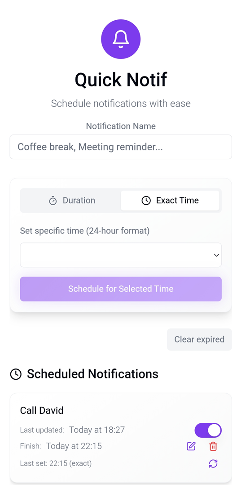

# Quick Notif

An Android notification scheduler with a home screen widget. Schedule notifications at a specific time of day or after a set duration, and manage them directly from the widget without opening the app.



## Prerequisites

Before building the project, make sure you have the following installed:

### Required

| Tool | Version | Notes |
|------|---------|-------|
| [Node.js](https://nodejs.org/) | 18+ | Runtime for the web layer |
| [npm](https://www.npmjs.com/) | 9+ | Comes bundled with Node.js |
| [JDK 21](https://www.oracle.com/java/technologies/downloads/#java21) | **Exactly 21** | Gradle 8.11.1 does not support Java 22+ |
| [Android SDK](https://developer.android.com/studio) | API 35 | Install via Android Studio |

To verify each tool is installed with the correct version:

```bash
node --version      # should print v18.x.x or higher
npm --version       # should print 9.x.x or higher
java --version      # should print java 21.x.x
adb --version       # should print Android Debug Bridge version x.x.x
```

> **JDK version is critical.** If your system default Java is newer than 21, you must explicitly set `JAVA_HOME` before running any Gradle command (see below).

### Android SDK Requirements

1. Download and install **[Android Studio](https://developer.android.com/studio)**.
2. Open Android Studio and go to **Settings → Languages & Frameworks → Android SDK** (or launch the **SDK Manager** from the welcome screen).
3. Under the **SDK Platforms** tab, check **Android 15 (API Level 35)** and click Apply.
4. Under the **SDK Tools** tab, check the following and click Apply:
   - **Android SDK Build-Tools 35**
   - **Android SDK Platform-Tools** (includes `adb`)
   - **Android Emulator** (only needed if testing on a virtual device)

### Environment Variables

Set `ANDROID_HOME` to point to your Android SDK location. Android Studio installs the SDK to a default path depending on your OS:

```bash
# Linux / macOS
export ANDROID_HOME=$HOME/Android/Sdk

# Windows (Git Bash / MINGW)
export ANDROID_HOME="$HOME/AppData/Local/Android/Sdk"
```

Then add the SDK tools to your `PATH` (run as-is):

```bash
export PATH="$ANDROID_HOME/platform-tools:$ANDROID_HOME/tools:$PATH"
```

---

## Setup

### 1. Install dependencies

```bash
npm install
```

### 2. Verify Android SDK path

```bash
adb version
```

If `adb` is not found, check your `ANDROID_HOME` and `PATH` setup above.

---

## Running Tests

Tests must pass before building the APK.

### TypeScript / React tests (Vitest)

```bash
npm test
```

### Android unit tests (Robolectric / JUnit)

Gradle requires JDK 21. Set `JAVA_HOME` first if your system default is a different version:

```bash
export JAVA_HOME="C:/Program Files/Java/jdk-21"   # Windows example
# export JAVA_HOME="/usr/lib/jvm/java-21-openjdk"  # Linux example
```

Then run the tests:

```bash
cd android && ./gradlew :app:testDebugUnitTest && cd ..
```

### Test coverage report (optional)

**TypeScript:**
```bash
npm run test:coverage
# Report: coverage/lcov-report/index.html
```

**Android:**
```bash
export JAVA_HOME="C:/Program Files/Java/jdk-21"
cd android && ./gradlew :app:jacocoTestReport && cd ..
# Report: android/app/build/reports/jacoco/jacocoTestReport/html/index.html
```

---

## Building the APK

Run the full build sequence in order. **Do not skip any step.**

```bash
# Step 1 — TypeScript/React tests
npm test

# Step 2 — Set JDK 21 (required for Gradle)
export JAVA_HOME="C:/Program Files/Java/jdk-21"

# Step 3 — Android unit tests
cd android && ./gradlew :app:testDebugUnitTest && cd ..

# Step 4 — Build web assets
npm run build

# Step 5 — Sync web assets to Android project
npx cap sync android

# Step 6 — Assemble the debug APK
cd android && ./gradlew assembleDebug && cd ..

# Step 7 — Copy APK to project root
cp android/app/build/outputs/apk/debug/app-debug.apk QuickNotif-latest.apk
```

The final APK is at `QuickNotif-latest.apk`.

### Install on a connected device

```bash
adb install QuickNotif-latest.apk
```

---

## Project Structure

```
QuickNotif/
├── src/                          # React / TypeScript source
│   ├── pages/Index.tsx           # Main app page, permission flow
│   ├── services/
│   │   ├── notificationService.ts  # Core scheduling logic
│   │   └── notificationLogger.ts   # Debug logging
│   └── components/               # UI components
├── android/                      # Native Android project
│   └── app/src/main/java/app/amir/quicknotif/
│       ├── MainActivity.java         # WebView bridge
│       ├── QuickNotifWidgetProvider.java  # Home screen widget
│       ├── QuickNotifWidgetService.java   # Widget data source
│       ├── NotificationReceiver.java     # Fires scheduled notifications
│       ├── BaseNotificationActivity.java # Shared dialog logic
│       ├── AddNotificationActivity.java  # Widget "add" dialog
│       ├── RescheduleActivity.java       # Widget "reschedule" dialog
│       ├── BootReceiver.java             # Restores alarms after reboot
│       ├── AlarmWatchdogWorker.java      # Periodic alarm integrity check
│       └── NotifUtils.java              # Shared utilities
├── capacitor.config.ts           # Capacitor configuration
├── package.json
└── package-lock.json
```

---

## Tech Stack

- **Frontend:** React 18, TypeScript, Vite, TailwindCSS, shadcn/ui
- **Mobile bridge:** Capacitor 7
- **Widget:** Native Android AppWidget (RemoteViews, ListView)
- **Storage:** Capacitor Preferences API (Android SharedPreferences)
- **Alarms:** Android AlarmManager with exact alarm scheduling
- **Background work:** WorkManager (alarm watchdog)
- **Testing:** Vitest (frontend), Robolectric + JUnit + Mockito (Android)
- **Build:** Gradle 8.11.1, AGP, JDK 21
- **Package manager:** npm

## Author

Developed by Amir Twil-Cohen
