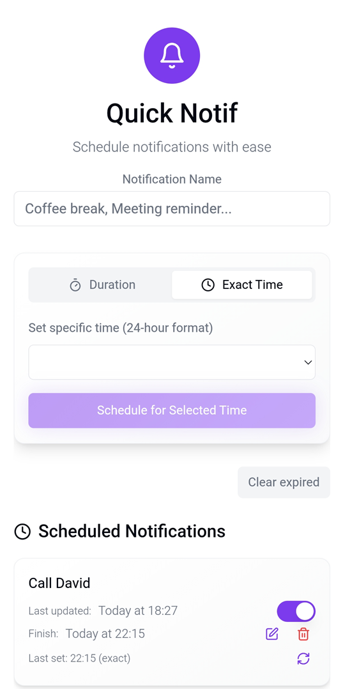

# Quick Notif

An Android notification scheduler with a home screen widget. Schedule notifications at a specific time of day or after a set duration, and manage them directly from the widget without opening the app.



## Table of Contents

- [Prerequisites](#prerequisites)
  - [Required](#required)
  - [Android SDK Requirements](#android-sdk-requirements)
  - [Environment Variables](#environment-variables)
- [Setup](#setup)
- [Running Tests](#running-tests)
  - [TypeScript / React tests](#typescript--react-tests-vitest)
  - [Android unit tests](#android-unit-tests-robolectric--junit)
  - [Test coverage report](#test-coverage-report-optional)
- [Building the APK](#building-the-apk)
- [Project Structure](#project-structure)
- [Tech Stack](#tech-stack)
- [Architecture](#architecture)
  - [How React and Android Talk to Each Other](#how-react-and-android-talk-to-each-other)
  - [Alarms, Not Direct Notifications](#alarms-not-direct-notifications)
  - [Two Scheduling Paths](#two-scheduling-paths)
  - [Shared Storage](#shared-storage)
  - [Notification ID Consistency](#notification-id-consistency)
  - [Alarm Reliability](#alarm-reliability)
- [Author](#author)

---

## Prerequisites

Before building the project, make sure you have the following installed:

### Required

| Tool | Version | Notes |
|------|---------|-------|
| [Node.js](https://nodejs.org/) | 18+ | Runtime for the web layer |
| [npm](https://www.npmjs.com/) | 9+ | Comes bundled with Node.js |
| [JDK 21](https://www.oracle.com/java/technologies/downloads/#java21) | **Exactly 21** | Gradle 8.11.1 does not support Java 22+ |
| [Android SDK](https://developer.android.com/studio) | API 35 | Install via Android Studio |

To verify each tool is installed with the correct version:

```bash
node --version      # should print v18.x.x or higher
npm --version       # should print 9.x.x or higher
java --version      # should print java 21.x.x
adb --version       # should print Android Debug Bridge version x.x.x
```

> **JDK version is critical.** If your system default Java is newer than 21, you must explicitly set `JAVA_HOME` before running any Gradle command (see below).

### Android SDK Requirements

1. Download and install **[Android Studio](https://developer.android.com/studio)**.
2. Open Android Studio and go to **Settings → Languages & Frameworks → Android SDK** (or launch the **SDK Manager** from the welcome screen).
3. Under the **SDK Platforms** tab, check **Android 15 (API Level 35)** and click Apply.
4. Under the **SDK Tools** tab, check the following and click Apply:
   - **Android SDK Build-Tools 35**
   - **Android SDK Platform-Tools** (includes `adb`)
   - **Android Emulator** (only needed if testing on a virtual device)

### Environment Variables

Set `ANDROID_HOME` to point to your Android SDK location. Android Studio installs the SDK to a default path depending on your OS:

```bash
# Linux / macOS
export ANDROID_HOME=$HOME/Android/Sdk

# Windows (Git Bash / MINGW)
export ANDROID_HOME="$HOME/AppData/Local/Android/Sdk"
```

Then add the SDK tools to your `PATH` (run as-is):

```bash
export PATH="$ANDROID_HOME/platform-tools:$ANDROID_HOME/tools:$PATH"
```

---

## Setup

### 1. Install dependencies

```bash
npm install
```

### 2. Initialize the Android project

This generates the native Android files required for building and running tests:

```bash
npm run build
npx cap sync android
```

### 3. Verify Android SDK path

```bash
adb version
```

If `adb` is not found, check your `ANDROID_HOME` and `PATH` setup above.

---

## Running Tests

Tests must pass before building the APK.

### TypeScript / React tests (Vitest)

```bash
npm test
```

### Android unit tests (Robolectric / JUnit)

Gradle requires JDK 21. Set `JAVA_HOME` first if your system default is a different version:

```bash
export JAVA_HOME="C:/Program Files/Java/jdk-21"   # Windows example
# export JAVA_HOME="/usr/lib/jvm/java-21-openjdk"  # Linux example
```

Then run the tests:

```bash
cd android && ./gradlew :app:testDebugUnitTest && cd ..
```

### Test coverage report (optional)

**TypeScript:**
```bash
npm run test:coverage
# Report: coverage/lcov-report/index.html
```

**Android:**
```bash
export JAVA_HOME="C:/Program Files/Java/jdk-21"
cd android && ./gradlew :app:jacocoTestReport && cd ..
# Report: android/app/build/reports/jacoco/jacocoTestReport/html/index.html
```

---

## Building the APK

Run the full build sequence in order. **Do not skip any step.**

```bash
# Step 1 — TypeScript/React tests
npm test

# Step 2 — Set JDK 21 (required for Gradle)
export JAVA_HOME="C:/Program Files/Java/jdk-21"

# Step 3 — Android unit tests
cd android && ./gradlew :app:testDebugUnitTest && cd ..

# Step 4 — Build web assets
npm run build

# Step 5 — Sync web assets to Android project
npx cap sync android

# Step 6 — Assemble the debug APK
cd android && ./gradlew assembleDebug && cd ..

# Step 7 — Copy APK to project root
cp android/app/build/outputs/apk/debug/app-debug.apk QuickNotif-latest.apk
```

The final APK is at `QuickNotif-latest.apk`.

### Install on a connected device

```bash
adb install QuickNotif-latest.apk
```

---

## Project Structure

```
QuickNotif/
├── src/                          # React / TypeScript source
│   ├── pages/Index.tsx           # Main app page, permission flow
│   ├── services/
│   │   ├── notificationService.ts  # Core scheduling logic
│   │   └── notificationLogger.ts   # Debug logging
│   └── components/               # UI components
├── android/                      # Native Android project
│   └── app/src/main/java/app/amir/quicknotif/
│       ├── MainActivity.java         # WebView bridge
│       ├── QuickNotifWidgetProvider.java  # Home screen widget
│       ├── QuickNotifWidgetService.java   # Widget data source
│       ├── NotificationReceiver.java     # Fires scheduled notifications
│       ├── BaseNotificationActivity.java # Shared dialog logic
│       ├── AddNotificationActivity.java  # Widget "add" dialog
│       ├── RescheduleActivity.java       # Widget "reschedule" dialog
│       ├── BootReceiver.java             # Restores alarms after reboot
│       ├── AlarmWatchdogWorker.java      # Periodic alarm integrity check
│       └── NotifUtils.java              # Shared utilities
├── capacitor.config.ts           # Capacitor configuration
├── package.json
└── package-lock.json
```

---

## Tech Stack

- **Frontend:** React 18, TypeScript, Vite, TailwindCSS, shadcn/ui
- **Mobile bridge:** Capacitor 7
- **Widget:** Native Android AppWidget (RemoteViews, ListView)
- **Storage:** Capacitor Preferences API (Android SharedPreferences)
- **Alarms:** Android AlarmManager with exact alarm scheduling
- **Background work:** WorkManager (alarm watchdog)
- **Testing:** Vitest (frontend), Robolectric + JUnit + Mockito (Android)
- **Build:** Gradle 8.11.1, AGP, JDK 21
- **Package manager:** npm

## Architecture

### How React and Android Talk to Each Other

The app is built with [Capacitor](https://capacitorjs.com/), which wraps the React web app inside a native Android `WebView`. The UI is HTML/CSS/JS rendered inside that WebView, while system-level features — alarms, permissions, widget refresh — are handled by Java.

There are two communication channels:

**1. Capacitor plugins** — The React app uses the official `@capacitor/local-notifications` and `@capacitor/preferences` plugins. These call into native Android code through Capacitor's internal bridge without any custom Java required.

**2. JavaScript interface (`window.Android`)** — `MainActivity.java` registers a `WebAppInterface` object on the WebView via `addJavascriptInterface(new WebAppInterface(), "Android")`. This exposes native Java methods directly to TypeScript as `window.Android.*`:

| Method | Purpose |
|--------|---------|
| `isBatteryOptimized()` | Check whether battery optimization is blocking alarms |
| `openBatterySettings()` / `openAutoStartSettings()` | Guide the user through required permission screens |
| `isAlarmScheduled(id)` / `checkAllAlarms(ids)` | Verify AlarmManager state from TypeScript |
| `cancelAlarmManagerNotification(id)` | Cancel a pending alarm directly |
| `refreshWidget()` | Trigger a widget redraw after storage changes |
| `canScheduleExactAlarms()` | Android 12+ exact alarm permission check |

In TypeScript these calls are wrapped in the `AndroidBridge` class (`notificationService.ts:56`) which provides safe no-op fallbacks when the app runs in a browser.

Android can also call back into JavaScript using `WebView.evaluateJavascript()`. For example, `MainActivity.onResume()` invokes `window.onExactAlarmPermissionMissing()` when the exact alarm permission has been revoked while the app was in the background.

### Alarms, Not Direct Notifications

When the user presses "Schedule", the app does **not** immediately create a system notification. Instead it registers an **AlarmManager alarm** — a future broadcast intent that Android will deliver at the exact requested time, even when the app is closed or the screen is off.

The delivery chain:

```
User schedules notification
        │
        ▼
AlarmManager alarm registered (exact, allow-while-idle)
        │
        │  (time passes — app may be fully closed)
        ▼
Android fires broadcast → NotificationReceiver.onReceive()
        │
        ▼
NotificationReceiver calls NotificationManager.notify()
        │
        ▼
Notification appears in the status bar
```

`NotificationReceiver` is a `BroadcastReceiver` declared in `AndroidManifest.xml`. When the alarm fires it reads the notification name from the intent extras, builds a `NotificationCompat` notification, and posts it. It also refreshes all widget instances so the widget immediately reflects the fired state.

This approach (alarm → receiver → notification) is the standard Android pattern for delivering time-sensitive notifications reliably, because AlarmManager delivery is guaranteed independent of the app process lifecycle.

### Two Scheduling Paths

Two separate code paths can register an AlarmManager alarm, and they produce identical results:

| Path | Where | When used |
|------|-------|-----------|
| Capacitor plugin | `notificationService.ts` → `LocalNotifications.schedule()` | User schedules from the React UI |
| Direct Java | `NotifUtils.scheduleAlarm()` | Widget reactivate/reschedule actions, boot recovery, watchdog |

The `LocalNotifications` plugin internally also uses AlarmManager, so both paths converge on the same broadcast to `NotificationReceiver` at the target time.

### Shared Storage

Both the React layer and native Java read and write to the **same storage**: Android SharedPreferences under the namespace `CapacitorStorage`. The `@capacitor/preferences` plugin writes here, and all Java components (`QuickNotifWidgetProvider`, `BootReceiver`, `AlarmWatchdogWorker`) read it directly via `NotifUtils.readNotificationsJson()`.

Notifications are stored as a JSON array under the `notifications` key:

```json
[
  {
    "id": "notification_1234567890_abc123",
    "name": "Take medicine",
    "time": "08:30",
    "type": "absolute",
    "enabled": true,
    "scheduledAt": "2026-02-27T08:30:00.000Z",
    "interval": null
  }
]
```

`interval` (in milliseconds) is only set for `relative` notifications and is used by the widget's Reactivate action to re-schedule the same duration from the current time.

### Notification ID Consistency

Each notification has a string ID like `notification_1234567890_abc123`. Android APIs require a 32-bit integer, so both sides independently convert the string using the **same DJB2-variant hash algorithm**:

- TypeScript: `toNumericId()` in `src/utils/notificationUtils.ts`
- Java: `NotifUtils.generateNumericId()` in `NotifUtils.java`

This integer is used as both the `AlarmManager` request code and the `NotificationManager` notification ID. This means that cancelling an alarm registered by one side will correctly cancel the alarm registered by the other.

> **Never change this algorithm.** Doing so would silently break all existing scheduled notifications on devices that have already installed the app.

### Alarm Reliability

Android can cancel AlarmManager alarms in several situations: device reboot, battery saver mode, or aggressive OEM memory management. The app defends against this with two mechanisms:

- **`BootReceiver`** — listens for `ACTION_BOOT_COMPLETED` and immediately re-registers all enabled future alarms from SharedPreferences, without needing to launch the app.
- **`AlarmWatchdogWorker`** — a `WorkManager` periodic task that runs every 60 minutes, compares the alarms stored in SharedPreferences against actually-registered `PendingIntent`s, and reschedules any that are missing.

---

## Author

Developed by Amir Twil-Cohen
